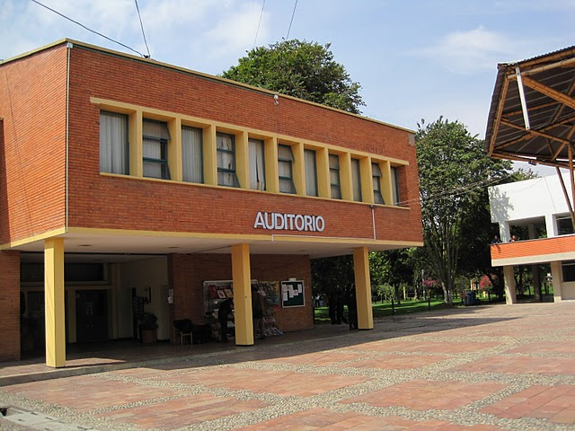

# Agronatura - Sitio Web de Unidades Productivas del SENA CBA

Accede al sitio web de Agronatura para conocer más sobre las unidades productivas del SENA CBA. En este sitio web, podrás obtener información detallada sobre las actividades y productos de las unidades de agricultura, avicultura y ganadería.

## Descripción del Proyecto

Este repositorio contiene el código fuente y los recursos utilizados para construir el sitio web de Agronatura. El sitio web presenta información sobre las unidades productivas del SENA CBA, destacando sus productos, actividades y logros en las áreas de agricultura, avicultura y ganadería.

## Características

- **Páginas Informativas:** Descubre detalles sobre cada una de las unidades productivas a través de páginas dedicadas a agricultura, avicultura y ganadería.

- **Galería de Imágenes:** Explora una galería de imágenes relacionadas con las actividades y productos de cada unidad.

- **Formulario de Contacto:** Comunícate con nosotros a través de un formulario de contacto donde podrás dejar tus comentarios y preguntas.

## Tecnologías Utilizadas

- HTML5
- CSS3
- JavaScript
- jQuery
- Materialize CSS
- GreenSock Animation Platform (GSAP)
- AutumnLeaf.js

## Acceso al Sitio Web

Para explorar el sitio web de Agronatura y conocer más sobre las unidades productivas del SENA CBA, simplemente haz clic en la imagen de arriba o visita el siguiente enlace: [Acceder al Sitio Web](http://agronatura.000webhostapp.com/)

¡Espero que disfrutes explorando el sitio web de Agronatura y aprendiendo más sobre las unidades productivas del SENA CBA!

